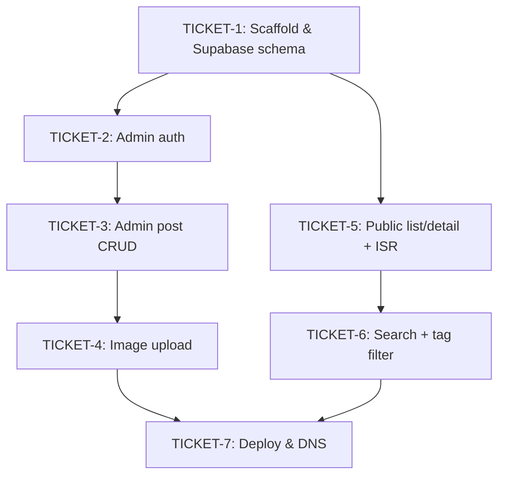

# Ticket Breakdown — Personal Blog Platform

## Epic summary

Ship a single-admin personal blog (Next.js + Supabase) so Jason can publish weekly write-ups —
text, code snippets, images — from a session-gated admin UI, with a public post list/detail
reading experience (search, tags, dark mode) live at `blog.developerjay.com`. Greenfield: no app
scaffold exists yet, so this breakdown covers MVP phases, not epic-on-existing-code slicing.

Source docs: `personal-blog-platform.prd.md` (PRD §1–9 + Architecture, same file) ·
`.claude/references/data-model.md` · `.claude/references/supabase-access-control.md`.

## Tickets

### TICKET-1 — Project scaffold, Supabase schema, and shared infra

- **Scope / acceptance criteria (one testable concern: the app boots against a real Supabase
  backend with the right access boundaries in place):**
  - Next.js App Router + TypeScript scaffold, Tailwind CSS configured.
  - Supabase SQL migration: `posts` table per the data model (id, slug, title, excerpt, content,
    cover_image_url, tags `text[]` GIN-indexed, status, published_at, created_at, updated_at); RLS
    policies (anon/public read limited to `status = 'published'`; full read/write for the
    authenticated admin session); Storage bucket for images.
  - `lib/supabase/server.ts` (service_role key, server-only — never imported into a client
    component) and `lib/supabase/client.ts` (anon key, browser-safe), kept as separate modules per
    the architecture's boundary rule.
  - `next-themes` `ThemeProvider` wired into the root layout + one reusable theme-toggle component
    (consumed later by both the public and admin layouts).
  - `middleware.ts` file created (routing stub only — the real session/email gating logic is
    Ticket 2's concern; this ticket just establishes the file so Ticket 2 doesn't create it from
    scratch).
  - `.env.local.example` documenting the required Supabase URL/keys.
  - Manual Supabase Auth config note: public sign-up must be explicitly disabled, one admin user
    created (dashboard step, not code — document it in a README/setup note, don't try to automate
    via SQL).
  - AC: `next build` succeeds; app connects to Supabase and can query the empty `posts` table;
    toggling the theme switches light/dark.
- **Per-ticket context:** `.claude/references/data-model.md` (schema) ·
  `.claude/references/supabase-access-control.md` (key boundaries + RLS) · CLAUDE.md architecture
  map (`lib/supabase/` split) · PRD Architecture § Key decisions (stack & libraries) and § Missing
  pieces (scaffold, schema/RLS/storage/auth config bullets).
- **Files touched (estimate):** `app/layout.tsx`, `middleware.ts`, `lib/supabase/server.ts`,
  `lib/supabase/client.ts`, `lib/theme/*`, Supabase migration SQL (checked in under
  `supabase/migrations/` or similar), `tailwind.config.ts`, `.env.local.example`, `package.json`.
- **Rough size:** ~600–900 lines (mostly config/scaffold, light on tests — nothing meaningfully
  unit-testable yet beyond a smoke build).
- **Depends on:** none.

### TICKET-2 — Admin authentication (login + middleware gating)

- **Scope / acceptance criteria (one testable concern: only the allowlisted admin can reach
  `/admin/*`):**
  - Login page (`app/admin/login`) using Supabase Auth (email/password, since public sign-up is
    disabled and there's exactly one admin account).
  - Real `middleware.ts` logic: checks for an active Supabase session **and** that the session's
    email matches the single allowlisted admin address (env var) — session presence alone is not
    sufficient per the architecture's access-control rule.
  - Logout action.
  - Unauthenticated or non-matching-email requests to `/admin/*` redirect to the login page.
  - AC: log in as the allowlisted admin → land on an `/admin` dashboard stub; log in as any other
    account (or no session) → redirected away from `/admin/*`.
- **Per-ticket context:** `.claude/references/supabase-access-control.md` (the exact two-part
  check: session + email allowlist) · Ticket 1's `middleware.ts` stub and
  `lib/supabase/server.ts`.
- **Files touched (estimate):** `middleware.ts` (fill in), `app/admin/login/page.tsx`,
  `app/admin/login/actions.ts`, `app/admin/layout.tsx` (session check), `app/admin/page.tsx`
  (dashboard stub), `app/admin/actions/logout.ts`.
- **Rough size:** ~400–600 lines.
- **Depends on:** TICKET-1.

### TICKET-3 — Admin post CRUD (create, edit, delete, draft/publish)

- **Scope / acceptance criteria (one testable concern: full post lifecycle from the admin UI):**
  - Admin post list page (all posts, any status, with status badges).
  - Create/edit form: title, slug (auto-generated from title, editable), excerpt, markdown content
    (textarea), tags input, draft/published status toggle.
  - Server Actions using the service_role client (`lib/supabase/server.ts`) for create/update/
    delete — no ad-hoc `createClient()` calls, per CLAUDE.md.
  - Delete with a confirmation step.
  - Publishing (draft → published) sets `published_at` and triggers ISR revalidation
    (`revalidatePath`/`revalidateTag`) for the public pages built in Ticket 5.
  - AC: create a draft, edit it, publish it, delete it — each step reflected correctly in the
    admin list and in the `posts` table.
- **Per-ticket context:** `.claude/references/data-model.md` (fields, no join table for tags) ·
  Ticket 2's gated `/admin` layout · CLAUDE.md rendering note (ISR revalidated on publish — the
  revalidation call belongs here since publish is the write-side trigger; Ticket 5 owns the
  read-side ISR config it triggers).
- **Files touched (estimate):** `app/admin/posts/page.tsx`, `app/admin/posts/new/page.tsx`,
  `app/admin/posts/[id]/edit/page.tsx`, `app/admin/posts/actions.ts` (create/update/delete/
  publish), `app/admin/posts/PostForm.tsx`, `app/admin/posts/DeleteButton.tsx`.
- **Rough size:** ~900–1300 lines (20–30% tests: Server Action behavior for status transitions and
  the slug-uniqueness/validation path).
- **Depends on:** TICKET-2 (needs the gated admin area to build within).

### TICKET-4 — Image upload to Storage

- **Scope / acceptance criteria (one testable concern: an admin can add an image to a post and see
  it rendered):**
  - Image upload widget embedded in the post editor from Ticket 3.
  - Upload handled server-side (Route Handler using the service_role client, consistent with the
    "service_role never reaches the client" boundary) against the Storage bucket from Ticket 1.
  - On successful upload, the resulting public URL is inserted as markdown image syntax into the
    content field at the cursor — no separate media table, per the data model (image URL goes
    straight into markdown content).
  - AC: upload an image while editing a post → markdown image syntax appears in the content field
    → image renders correctly once the post is viewed publicly (cross-check against Ticket 5's
    markdown renderer).
- **Per-ticket context:** `.claude/references/data-model.md` ("no separate media table... URL
  inserted straight into the post's markdown content") · Ticket 1's Storage bucket · Ticket 3's
  `PostForm.tsx` (this is where the widget mounts).
- **Files touched (estimate):** `app/admin/posts/ImageUpload.tsx`,
  `app/admin/posts/upload/route.ts` (Route Handler), edits to `PostForm.tsx`.
- **Rough size:** ~300–500 lines.
- **Depends on:** TICKET-3 (needs the post editor to embed into), TICKET-1 (Storage bucket).

### TICKET-5 — Public post list + detail pages (ISR + markdown rendering)

- **Scope / acceptance criteria (one testable concern: a reader can browse and read published
  posts, with code snippets rendered correctly):**
  - `app/(public)/page.tsx` — post list, published-only (enforced by RLS + the anon client), ISR
    with revalidation wired to match Ticket 3's publish-time `revalidatePath`/`revalidateTag` call.
  - `app/(public)/posts/[slug]/page.tsx` — post detail page, markdown rendered via
    `react-markdown` + `shiki`/`rehype-pretty-code` for syntax-highlighted code snippets.
  - Cover image and tag display on both list and detail views.
  - Dark-mode toggle wired into the public layout using Ticket 1's `ThemeProvider`/toggle
    component.
  - AC: published posts appear on both pages with correctly highlighted code; draft posts never
    appear (verify RLS is actually doing the filtering, not just an app-level query filter); the
    theme toggle persists across navigation.
- **Per-ticket context:** CLAUDE.md rendering rule (ISR, not per-request SSR) ·
  `.claude/references/supabase-access-control.md` (anon key, RLS-enforced published-only reads) ·
  PRD Architecture § Key decisions (`react-markdown` + `shiki`/`rehype-pretty-code`).
- **Files touched (estimate):** `app/(public)/page.tsx`, `app/(public)/posts/[slug]/page.tsx`,
  `app/(public)/layout.tsx`, `lib/markdown/render.ts` (the shiki/rehype pipeline), `PostCard.tsx`,
  `TagList.tsx`.
- **Rough size:** ~700–1000 lines.
- **Depends on:** TICKET-1 (schema, anon client, theme infra). Independent of TICKET-2/3/4's admin
  code (different route group, no shared files) — can be planned and built in parallel with them;
  seed a couple of published rows directly in Supabase to test this ticket standalone without
  waiting on the admin CRUD UI.

### TICKET-6 — Search + tag filtering (public)

- **Scope / acceptance criteria (one testable concern: a reader can narrow the post list by search
  term or tag):**
  - Postgres full-text search: a `tsvector` column/index (migration) covering title + content per
    the architecture's default (flagged as an assumption — the PRD leaves "title/tags only vs.
    both" as an open question; title+content is the safer default and cheap to narrow later).
  - Search input on the public post list page, debounced, querying via a Server
    Action/Route Handler against the anon client (published-only, RLS-enforced).
  - Clickable tag chips that filter the list by tag (array-contains query against the `tags`
    column).
  - AC: searching returns matching published posts ranked reasonably; clicking a tag narrows the
    list to posts carrying that tag; both filters compose (search + tag together) or at minimum
    don't conflict.
- **Per-ticket context:** PRD Architecture § Open questions (search scope is an implementation-time
  call) · `.claude/references/data-model.md` (`tags` is a GIN-indexed `text[]`, already indexed for
  array-contains filtering) · Ticket 5's post list page (this extends it, not a new page).
- **Files touched (estimate):** new migration for the `tsvector` column/index,
  `app/(public)/SearchBar.tsx`, `app/(public)/TagFilter.tsx`, edits to
  `app/(public)/page.tsx` and its data-fetching to accept search/tag query params.
- **Rough size:** ~400–600 lines.
- **Depends on:** TICKET-5 (extends the post list page), TICKET-1 (migration).

### TICKET-7 — Deploy & DNS

- **Scope / acceptance criteria (one testable concern: the MVP is live at the real domain):**
  - Vercel project connected to the repo, environment variables (Supabase URL/anon key/service_role
    key, admin allowlist email) configured in Vercel, not committed.
  - `blog.developerjay.com` CNAME added in Porkbun DNS, pointed at the Vercel deployment.
  - Production smoke check: public pages load over the real domain, ISR revalidation works after a
    real publish, `/admin` login works in production.
  - Mostly an ops/config ticket, not a code-heavy one — still worth its own pass since it's the
    PRD's actual "done" bar (time-to-first-post success metric).
- **Per-ticket context:** PRD Architecture § Missing pieces ("DNS: `blog.developerjay.com` CNAME in
  Porkbun pointing at the Vercel deployment") · PRD § Success Metrics (time-to-first-post).
- **Files touched (estimate):** `vercel.json` (if needed), deployment/env documentation in
  `README.MD`. Primarily dashboard configuration outside the repo (Vercel project settings, Porkbun
  DNS) — flag these steps clearly as manual/ops in the loop that picks this up.
- **Rough size:** small, <200 lines of repo changes; the bulk of the work is external configuration.
- **Depends on:** TICKET-4, TICKET-6 (needs the full MVP feature set — admin CRUD + images +
  public read/search — in place before it's worth going live).

## Dependency graph

## Suggested execution order

- **Wave 1:** TICKET-1 (everything depends on it — do this first, solo).
- **Wave 2 (parallel):** TICKET-2, TICKET-5 — both depend only on TICKET-1, touch disjoint file
  trees (`/admin` + `middleware.ts` vs. `app/(public)/`), safe to run in separate worktrees.
- **Wave 3:** TICKET-3 (needs TICKET-2's gated admin layout to build the CRUD UI inside).
- **Wave 4 (parallel):** TICKET-4 (needs TICKET-3's post editor), TICKET-6 (needs TICKET-5's public
  list page) — disjoint file trees (`app/admin/posts/` vs. `app/(public)/`), safe to parallelize.
- **Wave 5:** TICKET-7 (needs the full feature set from TICKET-4 and TICKET-6 before going live).

Plan just-in-time: don't plan TICKET-3 in detail until TICKET-2 is actually implemented (its auth
pattern shapes how the admin layout/session check gets consumed); same for TICKET-4 waiting on
TICKET-3's `PostForm.tsx`, and TICKET-6 waiting on TICKET-5's list-page data-fetching shape.
